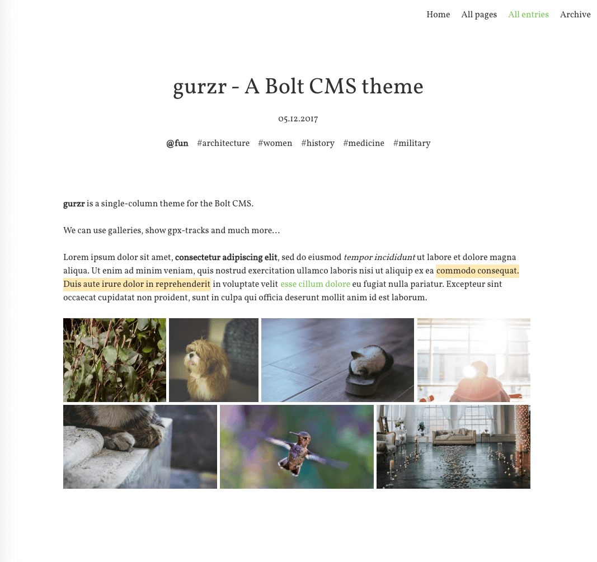

# gurzr Theme for Bolt CMS

__this project is work-in-progress atm!__

gurzr is a single-column theme for the [Bolt CMS](https://bolt.cm/).  
It's build with help of many other great projects:
- [Spectre.css](https://picturepan2.github.io/spectre/) as a great starting point for all kinds of styling
- [Vollkorn](http://vollkorn-typeface.com/) as its main font
- [PhotoSwipe](http://photoswipe.com/) for image galleries
- [leaflet](http://leafletjs.com/), [leaflet-gpx](https://github.com/mpetazzoni/leaflet-gpx) and maptiles from
the [Open Street Map Project](https://www.openstreetmap.org) to present gpx-tracks
- [highlight.js](https://highlightjs.org/) to style code-listings
- [Font Awesome](http://fontawesome.io/) for all kinds of icons
- [PasswordProtect extension](https://github.com/bobdenotter/PasswordProtect) to enable basic protection for private pages




<!-- TOC depthFrom:2 depthTo:6 withLinks:1 updateOnSave:1 orderedList:0 -->

- [Static Demo](#static-demo)
- [Features](#features)
  - [Menu](#menu)
  - [Custom Favicon](#custom-favicon)
  - [Custom CSS](#custom-css)
  - [Galleries](#galleries)
  - [GPX tracks](#gpx-tracks)
  - [Optional publishing of date and taxonomies](#optional-publishing-of-date-and-taxonomies)
  - [Subtitle](#subtitle)
  - [Latest posts template](#latest-posts-template)
  - [Archive template](#archive-template)
  - [Prevent listing](#prevent-listing)
  - [Maintenance text](#maintenance-text)
  - [Password Protection Extension](#password-protection-extension)
  - [Code highlighting](#code-highlighting)
  - [Copyright notice](#copyright-notice)
- [Example ContentType definition](#example-contenttype-definition)
- [ToDo](#todo)
- [License](#license)

<!-- /TOC -->

## Static Demo

A static demo of the theme can be found [here](https://znegva.github.io/bolt_themes_static_pages/gurzr/index.html).

## Features

### Menu

The `main` menu is used for the sidebar, you can adjust it in the
`config://menu.yml` file.

A `menu.yml` can look like this:
```yml
main:
    - label: Home
      title: Welcome page
      path: homepage
      class: first
    - label: Posts
      path: posts
    - label: Entries
      path: entries
    - label: Search
      path: search
```

### Custom Favicon

Just add a `favicon.png` with at least size of 180px*180px at the top level of
your files-folder and it will be used as _favicon_ as well as _apple-touch-icon_,
otherwise the themes [default favicon](images/favicon.png) will be used.

### Custom CSS

You can upload your own CSS-file to change some small things.
The file has to be named `custom.css` and be placed in the top level of your files-directory.

An example use of the `custom.css` is to change or add the prefix of taxonomy-links
in the header-section of record-pages. By default `tags` will be prefixed with a
hash #, `categories` will be prefixed with an @.  
Each taxonomy-link is being supplemented by its taxonomy-name as class name, so
to change the prefix of all tags to ♥ you could add the following to your `custom.css`:
```css
#header .taxonomies a.tags::before{
	content: '♥' !important;
}
```

### Galleries

gurzr supports galleries - to use them just add a field `gallery` with
`type: imagelist` to your ContentType.  
[PhotoSwipe](http://photoswipe.com/) is used as light-box for the gallery images.

Captions can be shown optionally, to manage this behavior add a field
`show_gallery_captions` with `type: checkbox` to your ContentType.

If you want the first image of your gallery to be shown bigger (full width) add 
a field `show_gallery_first_entry_big` with `type: checkbox` to your ContentType.

### GPX tracks

If you regularly publish gpx tracks with your posts, you can add a field `gpx`
with `type: file` to your ContentType.
You also have to extend `accept_file_types` in `config.yml` to accept
`gpx`-files in order to be able to upload your tracks. If a nonempty field `gpx`
is found in your record a map is drawn right below the content (and above a gallery, if there is one).

The map is created using [leaflet](http://leafletjs.com/) and
[leaflet-gpx](https://github.com/mpetazzoni/leaflet-gpx) and uses maptiles from
the [Open Street Map Project](https://www.openstreetmap.org), some symbols from
[Font Awesome](http://fontawesome.io/) are used in the footer to indicate
distance, duration and elevations of your track.

### Optional publishing of date and taxonomies

You can define for which ContentTypes the publishing date will be hidden
by adding `hide_publish_date: true` to your ContentTypes values in
`config://contenttypes.yml`.
Typically you don't want to show the _publishdate_ for pages.

Display of taxonomies can also be controlled via ContentType definition.
If you don't want taxonomy `tags` to be shown, just add
`hidden_taxonomy: [ tags ]` to your ContentType definition.
Hereby it is possible to use some taxonomies internally but not showing them to
your visitors.

The `publish_date` rule applies for listings and the records-page,
`hidden_taxonomies` is applied only to the record page, as we do not show
taxonomies in listings.


### Subtitle

You can define a markdown `subtitle`-field in your ContentType, this subtitle will
be rendered centered right below the title, above date and taxonomies
(if they are published, see above).

### Latest posts template

You can use the template `latest.twig`
(see [Bolt Docs](https://docs.bolt.cm/3.3/fields/templateselect)) to include
lists of the last three entries of each of your ContentTypes.
Please note that ContentTypes with `hide_in_listings: true` will not appear in
the list of the latest entries (see [below](#prevent-listing)).
Also `viewless` must not be set to `true`.  
The lists will be shown below the _normal_ content (title, body/content) of the
record whose template is set to `latest.twig`.

### Archive template

Similar to the _latest template_ (see above) there also exists an `archive.twig`
template which can be used to list __all__ records of all ContentTypes.
Again note that ContentTypes with `hide_in_listings: true` will not appear in
the list and `viewless` must not be set to `true`.

### Prevent listing

You can prevent showing of records of a certain ContentTypes in listings and
in in the _latest template_ and _archive template_ (see above) by adding
`hide_in_listings: true` to this ContentType.  
This can be useful for ContentTypes that should not be listable (e.g. pages) but
should despite this be showable (if you know the slug/url).
Unfortunately there seems to be no build-in parameter to _forbid_ listings for a
certain ContentType.  

### Maintenance text

To set an individual title and content of your Maintenance-Site, just create
`block/maintenance` (it has to have exactly this slug) and set title and content
there.  
In your `config.yml` set `maintenance_template: maintenance_default.twig`
(this should already be set by default).

### Password Protection Extension

The theme supports the [PasswordProtect extension by Bob den Otter](https://github.com/bobdenotter/PasswordProtect).  
To use it, just add the following new `field` to the `fields` of the ContentType
you want to protect:
```
use_password_protection:
            type: checkbox
            default: false
            label: 'Use the password protection provided by the PasswordProtect extension'
            variant: inline
```

Now you are able to decide which records you want to password protect.

Please note you have to provide a _redirect page_ in the configuration of the
__extension__.  
You have to create this page on your own, but you can use the `login.twig`
template provided by of this theme.  
Also the extension allows to define a custom form, we provide such a form by
`passwordform.twig` and it should be applied without any customization in the
extensions `config.yml`.

Password protected records are emphasized by a lock symbol in listings and the
record-page itself.

### Code highlighting

Code blocks are highlighted using [highlight.js](https://highlightjs.org/), the
theme used for highlighting can be defined in your `config.yml` via the parameter
`highlight_theme` (use only lowercase, eg: `highlight_theme: dracula`), see the
[highlight.js demo page](https://highlightjs.org/static/demo/) for previews of
the different themes.

### Copyright notice

If you regularly use content which needs a copyright notice, just add a field
`copyright` with `type: html` or `type:markdown` to your ContentType.
The notice will be added below your content, and below the gallery (if there is one).

## Example ContentType definition

An example ContentType-definition in your `contenttypes.yml` could be something like:
```yml
pages:
    name: Pages
    singular_name: Page
    fields:
        title:
            type: text
            class: large
            group: content
        slug:
            type: slug
            uses: title
        subtitle:
            type: markdown
            height: 100px
            group: content
        image:
            type: image
        teaser:
            type: markdown
            height: 150px
        body:
            type: html
            height: 300px
        template:
            type: templateselect
            filter: '*.twig'
    taxonomy: [ groups ]
    hidden_taxonomy: [ groups ]
    hide_publish_date: true
    viewless: false
    searchable: false
    recordsperpage: 10
    hide_publish_date: true
    hide_in_listings: true

posts:
    name: Posts
    singular_name: Post
    slug: posts
    singular_slug: post
    fields:
        title:
            type: text
            class: large
            group: content
        slug:
            type: slug
            uses: title
        body:
            type: markdown
            height: 300px
        image:
            type: image
            group: content
        show_image_above_body:
            type: checkbox
            default: false
            label: "Shall the teaserimage be shown above the content?"
            group: content
        use_password_protection:
            type: checkbox
            default: false
            label: 'Use the password protection provided by the PasswordProtect extension'
            variant: inline

        gallery:
            type: imagelist
            extensions: [ gif, jpg, png ]
            group: content
        show_gallery_captions:
            type: checkbox
            default: false
            label: 'Show captions for gallery'
            variant: inline
        show_gallery_first_entry_big:
            type: checkbox
            default: false
            label: 'Shall the first gallery image be shown bigger'
            variant: inline

        copyright:
            type: markdown
            group: content

        gpx:
            type: file
            extensions: [ gpx ]
            group: content
            label: 'GPX track related to the post'
    relations:
        posts:
            multiple: true
            order: title
            label: Select related other posts
    taxonomy: [ groups, categories, tags ]
    hidden_taxonomy: [ groups ]
    default_status: published
    sort: -datepublish
    recordsperpage: 5
```

## ToDo

- [ ] support fa-icons in menu
- [x] add image to readme
- [x] provide example contenttype-definition
- [x] fix `active`-class in menu for pagination-pages of listings and search results

## License

Open sourced under the [MIT license](LICENSE.md).

<3
